** Types of Graph:

1. Line Graph: 
2. Bar chart: Comparing differences/similarities between groups.
3. Scatter plot: Finding Correaltion between two variables. Useful for identifying outliers.
4. Pie Chart: Gives proportions for simple data.


```python
import numpy as np
import matplotlib.pyplot as plt 
```


```python
x = np.linspace(0, 20, 100)
y = np.sin(x)
z = np.sin(x + (np.pi)/2)
plt.plot(x, y, 'red')
plt.plot(x, z, 'black')
plt.show()
```


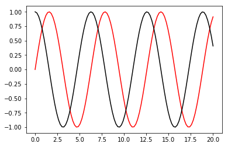


```python
x
```


    array([  0.        ,   0.2020202 ,   0.4040404 ,   0.60606061,
             0.80808081,   1.01010101,   1.21212121,   1.41414141,
             1.61616162,   1.81818182,   2.02020202,   2.22222222,
             2.42424242,   2.62626263,   2.82828283,   3.03030303,
             3.23232323,   3.43434343,   3.63636364,   3.83838384,
             4.04040404,   4.24242424,   4.44444444,   4.64646465,
             4.84848485,   5.05050505,   5.25252525,   5.45454545,
             5.65656566,   5.85858586,   6.06060606,   6.26262626,
             6.46464646,   6.66666667,   6.86868687,   7.07070707,
             7.27272727,   7.47474747,   7.67676768,   7.87878788,
             8.08080808,   8.28282828,   8.48484848,   8.68686869,
             8.88888889,   9.09090909,   9.29292929,   9.49494949,
             9.6969697 ,   9.8989899 ,  10.1010101 ,  10.3030303 ,
            10.50505051,  10.70707071,  10.90909091,  11.11111111,
            11.31313131,  11.51515152,  11.71717172,  11.91919192,
            12.12121212,  12.32323232,  12.52525253,  12.72727273,
            12.92929293,  13.13131313,  13.33333333,  13.53535354,
            13.73737374,  13.93939394,  14.14141414,  14.34343434,
            14.54545455,  14.74747475,  14.94949495,  15.15151515,
            15.35353535,  15.55555556,  15.75757576,  15.95959596,
            16.16161616,  16.36363636,  16.56565657,  16.76767677,
            16.96969697,  17.17171717,  17.37373737,  17.57575758,
            17.77777778,  17.97979798,  18.18181818,  18.38383838,
            18.58585859,  18.78787879,  18.98989899,  19.19191919,
            19.39393939,  19.5959596 ,  19.7979798 ,  20.        ])


```python
y
```


    array([ 0.        ,  0.20064886,  0.39313661,  0.56963411,  0.72296256,
            0.84688556,  0.93636273,  0.98775469,  0.99897117,  0.96955595,
            0.90070545,  0.79522006,  0.65739025,  0.49282204,  0.30820902,
            0.11106004, -0.09060615, -0.28858706, -0.47483011, -0.64176014,
           -0.7825875 , -0.89158426, -0.96431712, -0.99782778, -0.99075324,
           -0.94338126, -0.85763861, -0.73701276, -0.58640998, -0.41195583,
           -0.22074597, -0.0205576 ,  0.18046693,  0.37415123,  0.55261747,
            0.7086068 ,  0.83577457,  0.92894843,  0.98433866,  0.99969234,
            0.97438499,  0.90944594,  0.8075165 ,  0.6727425 ,  0.51060568,
            0.32770071,  0.13146699, -0.07011396, -0.26884313, -0.45663749,
           -0.62585878, -0.76962418, -0.88208623, -0.95867071, -0.99626264,
           -0.99333304, -0.95000106, -0.86802917, -0.75075145, -0.60293801,
           -0.43060093, -0.24074979, -0.0411065 ,  0.16020873,  0.35500771,
            0.53536727,  0.69395153,  0.82431033,  0.9211415 ,  0.98050658,
            0.99999098,  0.9788022 ,  0.91780205,  0.81947165,  0.68781042,
            0.5281735 ,  0.34705389,  0.15181837, -0.04959214, -0.24898556,
           -0.43825186, -0.6096929 , -0.75633557, -0.87221538, -0.95261911,
           -0.99427643, -0.995493  , -0.95621934, -0.87805285, -0.76417283,
           -0.61921119, -0.44906404, -0.26065185, -0.06163804,  0.13988282,
            0.33571414,  0.51789078,  0.67900297,  0.81249769,  0.91294525])


```python
plt.xlabel('Time')
plt.ylabel('Amplitude')
plt.title('Waveform')
plt.plot(x, y, 'red')
plt.plot(x, z, 'black')
plt.show()
```


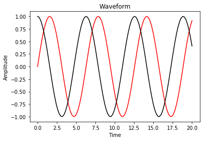


```python
plt.xlim(-5, 25)
plt.ylim(-2, 2)
plt.xlabel('Time')
plt.ylabel('Amplitude')
plt.title('Waveform')
plt.plot(x, y, 'red')
plt.plot(x, z, 'black')
plt.show()
```


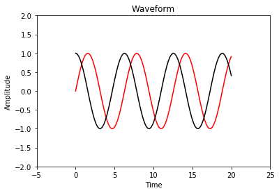


```python
plt.xticks([-10, 0, 10, 20])
plt.yticks([-2, -1, 0, 1, 2])
plt.xlabel('Time')
plt.ylabel('Amplitude')
plt.title('Waveform')
plt.plot(x, y, 'red')
plt.plot(x, z, 'black')
plt.show()
```


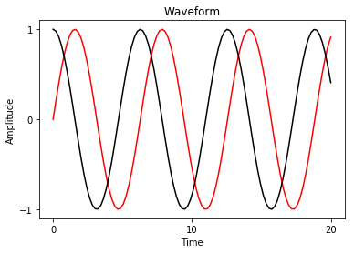


```python
plt.xlabel('Time')
plt.ylabel('Amplitude')
plt.title('Waveform')
plt.plot(x, y, 'red')
plt.plot(x, z, 'black')
plt.legend(["sine", "cosine"])

plt.show()
```


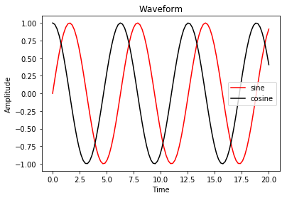


```python
plt.stem(x, y)
plt.show()
```


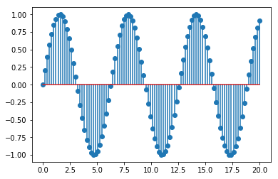


```python
year = [1992, 2002, 2007]
population = [22, 25, 31]
plt.plot(year, population)
plt.show()
```


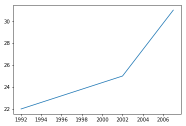


```python
year = [1890, 1900, 1980] + year
population = [6.4, 6.5, 7.9] + population
plt.plot(year, population)
plt.show()
```


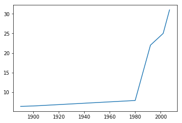


```python
population_ages = [22, 45, 46, 22, 56, 78, 55, 30, 65, 43, 62, 5, 5, 4, 56, 5, 69, 89, 62, 102, 78, 107]
plt.hist(population_ages, bins = 10, histtype = "bar", rwidth = 0.8)
plt.show()
```


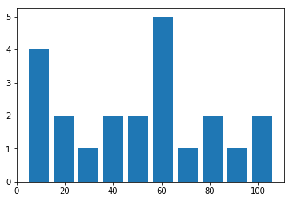


```python
population_ages = [94, 93, 95] + population_ages
plt.hist(population_ages, bins = 10, histtype = "bar", rwidth = 0.8)
plt.show()
```


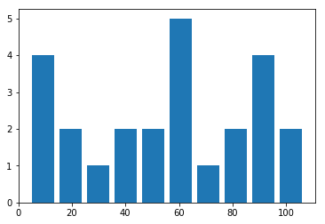


```python
days = [1, 2, 3, 4, 5]
sleeping = [7, 8, 6, 11, 7]
eating = [2, 3, 4, 3, 2]
working = [7, 8, 7, 2, 2]
playing = [8, 5, 7, 8, 13]
plt.stackplot(days, sleeping, eating, working, playing)
plt.legend(["sleeping", "eating", "working", "playing"])
plt.show()
```


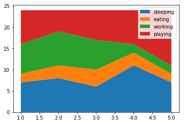


```python
slices = [7, 2, 2, 13]
plt.pie(slices)
plt.show()
```


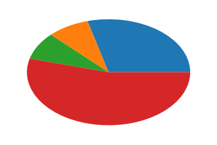


```python
slices = [7, 2, 2, 8]
plt.pie(slices, startangle = 90, shadow = "True")
plt.legend(["sleeping", "eating", "working", "playing"])
plt.show()
```


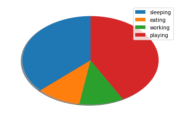


```python
slices = [7, 2, 2, 8]
plt.pie(slices, startangle = 90, shadow = "True", explode = (0, 0.1, 0, 0))
plt.legend(["sleeping", "eating", "working", "playing"])
plt.show()
```


```python
slices = [7, 2, 2, 8]
plt.pie(slices, startangle = 90, shadow = "True", explode = (0, 0.1, 0, 0), autopct ='%1.1f%%')
plt.legend(["sleeping", "eating", "working", "playing"])
plt.show()
```


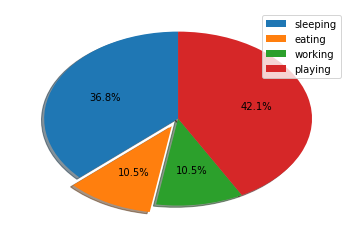


```python
import pandas as pd
```


```python
sample_data = pd.read_csv("C:\\Users\\app\\Desktop\\sample_data.csv")
print(sample_data)
```

       column_a  column_b  column_c
    0         1         1        10
    1         2         4         8
    2         3         9         6
    3         4        16         4
    4         5        25         2
    


```python
plt.plot(sample_data.column_a, sample_data.column_b, 'o', markersize = 10)
plt.show()
```


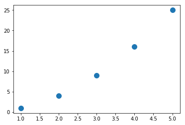


```python
plt.plot(sample_data.column_a, sample_data.column_c)
plt.show()
```


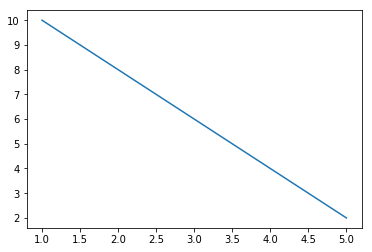


```python
data = pd.read_csv("C:\\Users\\app\\Desktop\\countries.csv")
print(data)
```

              country  year  population
    0     Afghanistan  1952     8425333
    1     Afghanistan  1957     9240934
    2     Afghanistan  1962    10267083
    3     Afghanistan  1967    11537966
    4     Afghanistan  1972    13079460
    5     Afghanistan  1977    14880372
    6     Afghanistan  1982    12881816
    7     Afghanistan  1987    13867957
    8     Afghanistan  1992    16317921
    9     Afghanistan  1997    22227415
    10    Afghanistan  2002    25268405
    11    Afghanistan  2007    31889923
    12        Albania  1952     1282697
    13        Albania  1957     1476505
    14        Albania  1962     1728137
    15        Albania  1967     1984060
    16        Albania  1972     2263554
    17        Albania  1977     2509048
    18        Albania  1982     2780097
    19        Albania  1987     3075321
    20        Albania  1992     3326498
    21        Albania  1997     3428038
    22        Albania  2002     3508512
    23        Albania  2007     3600523
    24        Algeria  1952     9279525
    25        Algeria  1957    10270856
    26        Algeria  1962    11000948
    27        Algeria  1967    12760499
    28        Algeria  1972    14760787
    29        Algeria  1977    17152804
    ...           ...   ...         ...
    1674  Yemen, Rep.  1982     9657618
    1675  Yemen, Rep.  1987    11219340
    1676  Yemen, Rep.  1992    13367997
    1677  Yemen, Rep.  1997    15826497
    1678  Yemen, Rep.  2002    18701257
    1679  Yemen, Rep.  2007    22211743
    1680       Zambia  1952     2672000
    1681       Zambia  1957     3016000
    1682       Zambia  1962     3421000
    1683       Zambia  1967     3900000
    1684       Zambia  1972     4506497
    1685       Zambia  1977     5216550
    1686       Zambia  1982     6100407
    1687       Zambia  1987     7272406
    1688       Zambia  1992     8381163
    1689       Zambia  1997     9417789
    1690       Zambia  2002    10595811
    1691       Zambia  2007    11746035
    1692     Zimbabwe  1952     3080907
    1693     Zimbabwe  1957     3646340
    1694     Zimbabwe  1962     4277736
    1695     Zimbabwe  1967     4995432
    1696     Zimbabwe  1972     5861135
    1697     Zimbabwe  1977     6642107
    1698     Zimbabwe  1982     7636524
    1699     Zimbabwe  1987     9216418
    1700     Zimbabwe  1992    10704340
    1701     Zimbabwe  1997    11404948
    1702     Zimbabwe  2002    11926563
    1703     Zimbabwe  2007    12311143
    
    [1704 rows x 3 columns]
    


```python
us = data[data.country == 'United States']
china = data[data.country == 'China']
print(us)
```

                country  year  population
    1608  United States  1952   157553000
    1609  United States  1957   171984000
    1610  United States  1962   186538000
    1611  United States  1967   198712000
    1612  United States  1972   209896000
    1613  United States  1977   220239000
    1614  United States  1982   232187835
    1615  United States  1987   242803533
    1616  United States  1992   256894189
    1617  United States  1997   272911760
    1618  United States  2002   287675526
    1619  United States  2007   301139947
    


```python
data.country == 'United States'
```


    0       False
    1       False
    2       False
    3       False
    4       False
    5       False
    6       False
    7       False
    8       False
    9       False
    10      False
    11      False
    12      False
    13      False
    14      False
    15      False
    16      False
    17      False
    18      False
    19      False
    20      False
    21      False
    22      False
    23      False
    24      False
    25      False
    26      False
    27      False
    28      False
    29      False
            ...  
    1674    False
    1675    False
    1676    False
    1677    False
    1678    False
    1679    False
    1680    False
    1681    False
    1682    False
    1683    False
    1684    False
    1685    False
    1686    False
    1687    False
    1688    False
    1689    False
    1690    False
    1691    False
    1692    False
    1693    False
    1694    False
    1695    False
    1696    False
    1697    False
    1698    False
    1699    False
    1700    False
    1701    False
    1702    False
    1703    False
    Name: country, Length: 1704, dtype: bool


```python
plt.plot(us.year, us.population/10**9, label = 'United States')
plt.legend()
plt.show()
```


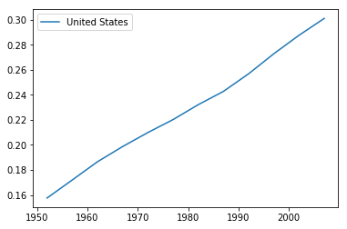


```python
plt.plot(china.year, china.population/10**9, label = "China")
plt.legend()
plt.show()
```


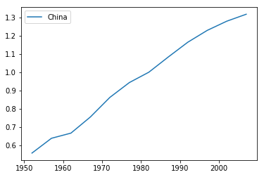


```python
us_growth_rate = ((us.population - us.population.min())/us.population.min())
china_growth_rate = ((china.population - china.population.min())/china.population.min())
plt.plot(us.year, us_growth_rate, 'o')
plt.plot(china.year, china_growth_rate, 'o')
plt.show()
```


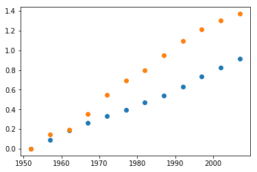

